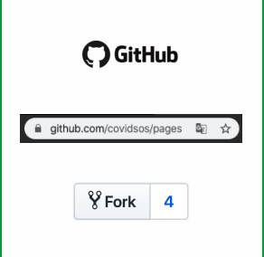
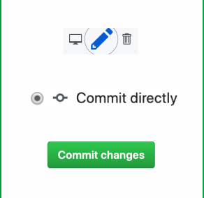
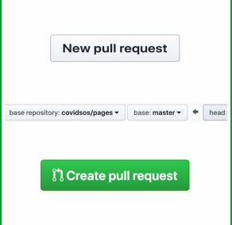
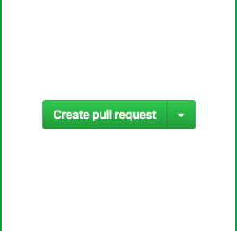

# Redacta

Si conoces markdown, tienes atención al detalle y tienes experiencia en
 el uso de github, envíanos un correo a hola@covidsos.mx, cuéntanos de tu
  experiencia y no olvides proporcionarnos tu usuario de github.

## Guía para redactar

1. Ingresa a [COVIDSOS](https://github.com/covidsos/pages)

2. Revisa, edita y guarda.

3. Regresa a tu fork.
 y crea un pull request.
 

4. Revisa por última vez y confirma.

