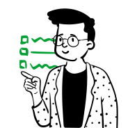

<simple-hero>

<section class="message">

# El mundo necesita nuestra ayuda

México y el mundo enfrentan una enorme **escasez de equipamiento médico** para
 combatir la pandemia COVID-19 causada por el coronavirus.
 
COVIDSOS es un **Repositorio Abierto** y un **<strike>Content</strike> Help
 Management System Global** que busca organizar la inteligencia colectiva y 
 apoyar a todo aquel al frente de esta lucha.

<covidsos-button>

[Ver repositorio](./es/repositorio)

</covidsos-button>

Cualquier persona con una cuenta en [Github](https://github.com/) puede
 [registrarse](/connect) y colaborar.  

</section>

</simple-hero>

<single-column>

## Ayuda

**Las circunstancias evolucionan constantemente por lo que es importante
  mantenerse atento a los anuncios en este sitio**. 
  
  Hemos creado una metodología que permite a todos
 colaborar mediante actividades específicas para distintos niveles técnicos o
  conocimiento.

</single-column>

<card-holder>

<simple-card>

### Sugiere

Sube contenido de calidad como manuales, planos, guías, etc., que ayude a la
 creación de equipo médico.

[Conocer más](./es/como-ayudar/sugiere)

</simple-card>

<simple-card>

### Redacta

Si conoces markdown y tienes atención al detalle, corrobora
 el contenido que se sube al repositorio.
 
[Conocer más](./es/como-ayudar/redacta)

</simple-card>

<simple-card>

### Revisa

Si tu experiencia te permite validar el contenido y efectividad
 del equipo, necesitamos expertos en muchísimas áreas.

[Conocer más](./es/como-ayudar/revisa)

</simple-card>

<simple-card>

### Certifica

Si perteneces a una institución reconocida certifica que el equipamiento médico
 cumple con los estándares mínimos.

[Conocer más](./es/como-ayudar/certifica)

</simple-card>

<simple-card>

### Construye

Si eres un maker utiliza nuestro repositorio para crear los equipos médicos 
 validados y certificados.

[Conocer más](./es/como-ayudar/construye)

</simple-card>

<simple-card>

### Cuestiona

Conoces un equipo, material, herramienta u otro y crees que el contenido 
 debe mejorar, colabora con tus comentarios.

[Conocer más](./es/como-ayudar/cuestiona)

</simple-card>

<simple-card>

### Traduce

COVIDSOS soporta cualquier idioma, ayúdanos a que éste conocimiento
 llegue a la mayor cantidad de personas posible.

[Conocer más](./es/como-ayudar/traduce)

</simple-card>

<simple-card>

### Difunde

Cualquiera podrá clonar nuestro sitio, ponerle su diseño y publicarlo gratis
 con las mejores CDNs del mundo.

**PRÓXIMAMENTE**

</simple-card>

</card-holder>
