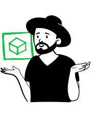

<simple-hero>

# El mundo necesita tu ayuda

México y el mundo enfrentan una enorme escasez de equipamiento médico para
 combatir la enfermedad COVID-19.
 
[Ver más](#¿cómo-ayudar)

</simple-hero>

<text-banner>

COVIDSOS es un repositorio open source construído para organizar y coordinar 
los esfuerzos de las personas que desean contribuir con ayuda de múltiples
 maneras durante los efectos de la pandemia causada por el coronavirus.
 
</text-banner>

<slim-column>

## ¿Cómo ayudar?

</slim-column>

<simple-card>

### Sugiriendo

Identifica y sugiere instrucciones o planos

</simple-card>

<simple-card>

### Escribiendo

Regístrate, genera contenido y envíalo a revisión

</simple-card>

<simple-card>

### Colaborando

Consulta el repositorio y colabora eligiendo las mejores entradas

</simple-card>

<simple-card>

### Revisando

Necesitamos de expertos que nos ayuden a identificar y corregir problemas antes de aprobarlos.

</simple-card>

<simple-card>

### Certificando

Requerimos de instituciones que certifiquen la efectividad del equipo a construir

</simple-card>

<simple-card>

### Traduciendo

COVIDSOS soporta cualquier idioma del mundo.

</simple-card>

<simple-card>

### Construyendo

Se requieren makers que puedan construir los equipos y donarlos.

</simple-card>

